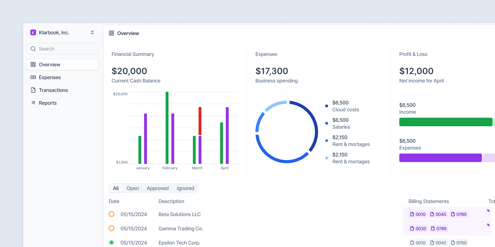

# Klarbook

An open-source alternative to QuickBooks for modern businesses, powered by the latest tech and AI.

## About

Klarbook is a comprehensive accounting and financial management solution designed to provide businesses with a powerful, flexible, and cost-effective alternative to traditional accounting software like QuickBooks.

## Current Status

> [!NOTE]
> This project is in early stage development.

We've been developing Klarbook for over 12 months in our spare time, and we've now released most of our code to the open-source community. We're currently working on adding more features and improving the platform.

## Tech Stack

- **Frontend**: [Nuxt 4](https://nuxt.com/) + [Vue.js](https://vuejs.org/)
- **Styling**: [Tailwind CSS](https://tailwindcss.com/)
- **Backend**: [Nitro](https://nitro.unjs.io/)
- **Background Jobs**: [Trigger.dev](https://trigger.dev/)
- **Database**: Postgres, Drizzle ORM
- **Integrations**: Various banking data providers

### Why Vue/Nuxt instead of React?

We chose Vue and Nuxt because it's what we know best.

## Immediate Roadmap

We're actively working on a comprehensive roadmap and task list for the project.

## Features (In Development)

- Invoice processing
- Bank transaction syncing
- Document management and OCR
- Integration with popular payment providers
- AI-powered transaction categorization

## Get Involved

We're excited to have the community involved! While we're still establishing formal contribution guidelines, feel free to:

- Open issues for bugs or feature requests
- Join discussions about the project's direction
- Join our [Discord](https://discord.gg/Kg56f7u2eW)
